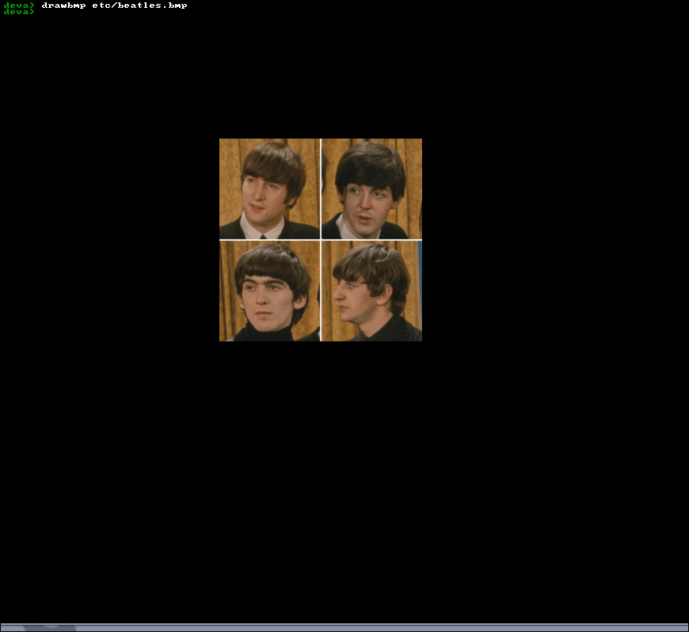
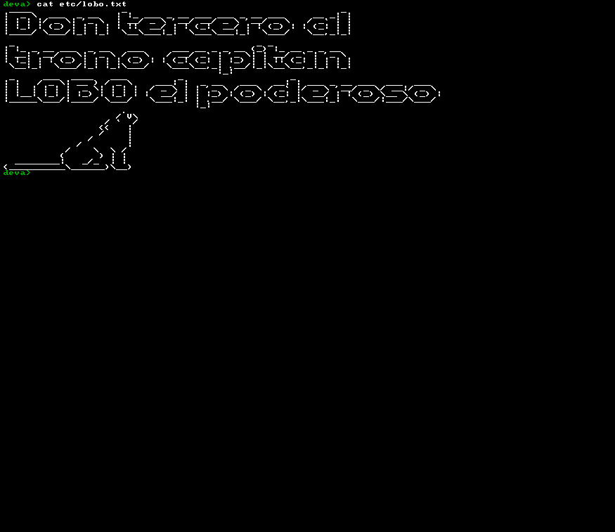

# deva : sistema operativo
deva es un sistema operativo creado **desde cero**(osdev) personal que se tiene su codigo bajo dominio publico

## ¿Que esperar?
- Como usuario puedes esperar un sistema inestable, con bugs, no usable entre otras peculiaridades
- Como desarollador puedes esperar un codigo todo revuelto, mal hecho, un sistema mal diseñado, entre otras cosas

## Caracteristicas
### Dispositivos soportados
- ATA
- Teclado

### Otras cosas
- ELF
- FAT32
- Framebuffer
- GDT
- Paginado
- Multitarea
- Sistema de archivos virtual (VFS)
- Soporte para programas
- Libreria de C (en progreso)

### Arquictecturas soportadas
- i386/i686 : como sea que se llame, es la arquitectura principal
